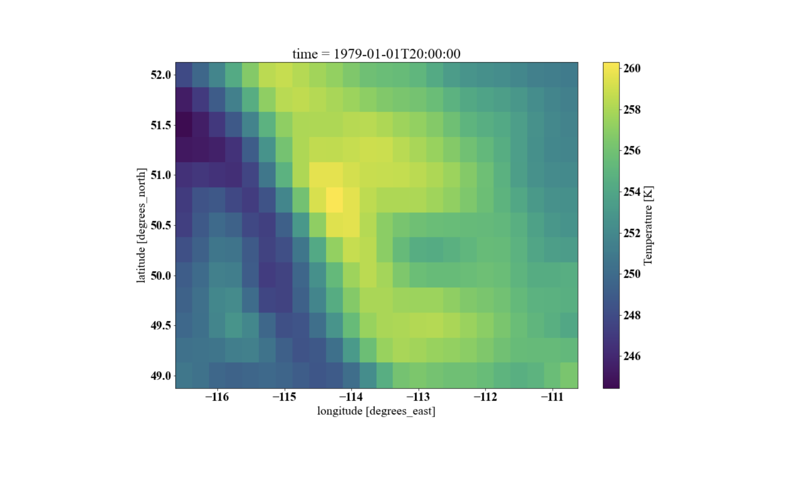

 

# CANDEX: CAtchment NetcDf EXtractor:

This package allows you to extract and aggregate the relevant values from a
cfconventions compliant netcdf files given shapefiles.

CANDEX is a collection of functions that allows extraction of the data from a NetCDF file for a given shapefile such as a basin, catchment. It can map gridded data or model output to any given shapefile and provide area average for a target variable.

Candex is very efficient as it uses pandas `groupby` functionality. Remapping of the entire north American domain from ERA5 with resolution of 0.25 degree to 500,000 subbasins of MERIT-Hydro watershed for 7 variables in 1.2 seconds for one time step (the time varying from device to device and depending on the source netCDF files sizes and their temporal aggregation).

## The code can be used for the following purposes:

1. Remapping the relevant forcing variables, such as precipitation or temperature and other variables for the effortless model set up. This transfer can be from Thiessen polygon or gridded data, for example, to computational units, hydrological model for example.
2. Remapping the output of a hydrological or land surface model to force another model, such as providing the gridded model output in sub-basin for routing.
3. Extraction of single or multiple points from the gridded or irregular data for comparison with gauges data, for example.
4. Interpolation to caorser or finer resolutions with full controllability in creating the interpolation rules.

## How to use:

clone the code on your perosnal computer by

`git clone https://github.com/ShervanGharari/candex_newgen.git`

go to the candex folder, where `setup.py` is located and install candex locally:

`pip install .`

## Examples:

1. [Remapping a regular lat/lon gridded data or model output to irregular shapes.](./examples/Chapter1_E1.ipynb)
2. [Remapping a rotate lat/lon gridded data or model output to irregular shapes.](./examples/Chapter1_E2.ipynb)
3. [Remapping an irregular shapefile data, such as Thiessen polygon for example, to irregular shapes.](./examples/Chapter1_E3.ipynb)
4. [Extract the data for points (such as location of stations, cities, etc) from the grided or irregular shapefiles; temprature example](./examples/Chapter1_E4.ipynb)
5. [Resampling of regular, rotated or irregular data and model output to any resolution density of the points](./examples/Chapter1_E5.ipynb)
6. [Manipulation of remapped variables such as lapse rate to temperature based on elevation difference (can be applied to slope and aspect, etc)](./examples/Chapter1_E6.ipynb)

The two figures show remapping of the gridded temperature from ERA5 data set to subbasin of South Saskatchewan River at Medicine Hat.

### Original gridded temperature field:

### Remapped temperature field to the subbasins:

## Publication that have used CANDEX so far:

Gharari, S., Clark, M. P., Mizukami, N., Knoben, W. J. M., Wong, J. S., and Pietroniro, A.: Flexible vector-based spatial configurations in land models, Hydrol. Earth Syst. Sci., 24, 5953–5971, https://doi.org/10.5194/hess-24-5953-2020, 2020

Sheikholeslami, R., Gharari, S. Papalexiou, S. M., Clark, M. P.: VISCOUS: A Variance-Based Sensitivity Analysis Using Copulas for Efficient Identification of Dominant Hydrological Processes, submitted to Water Resources Research, https://doi.org/10.1002/essoar.10505333.1, 2020.
